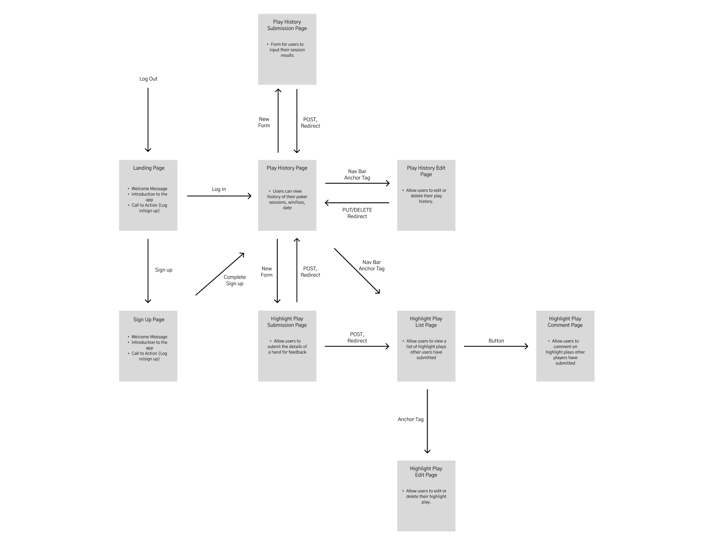

RENDER LINK:
https://project2-stacktrack.onrender.com


# StackTrack: Poker Bankroll Management App - project2
Thank you for checking out **StackTrack**, your go-to app for managing your poker bankroll! Whether you're grinding micro stakes or playing the high roller tables, this app helps you track your wins and losses efficiently, so you can stay focused on your strategy! :chart_with_upwards_trend:
## [Click here](https://project2-stacktrack.onrender.com) :computer_mouse: to see my live project!
## About :open_book:
- StackTrack allows poker players to easily record their play sessions across different blind levels, track their bankroll performance, and even share highlight plays with the community. :trophy:
- Players can review their session history, submit highlight plays, and provide feedback on others' hands to improve decision-making at every stage of the game.
- To download **StackTrack** from GitHub:
```
git clone https://github.com/cdc998/project2-StackTrack.git
cd project2-StackTrack

npm i
npm start
```
- Create a PSQL database based on the schema file.
- Navigate to your preferred web browser, and access the web app through port **4444**. :computer:
