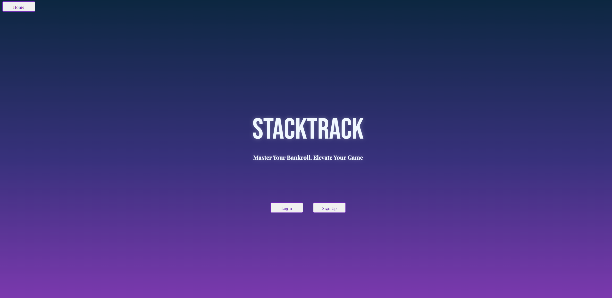
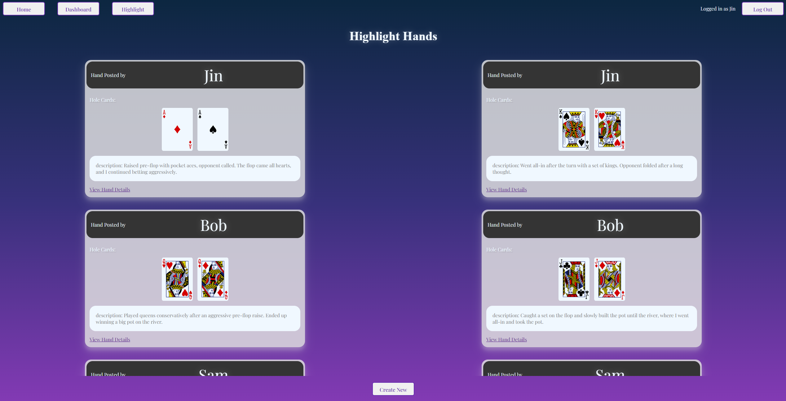
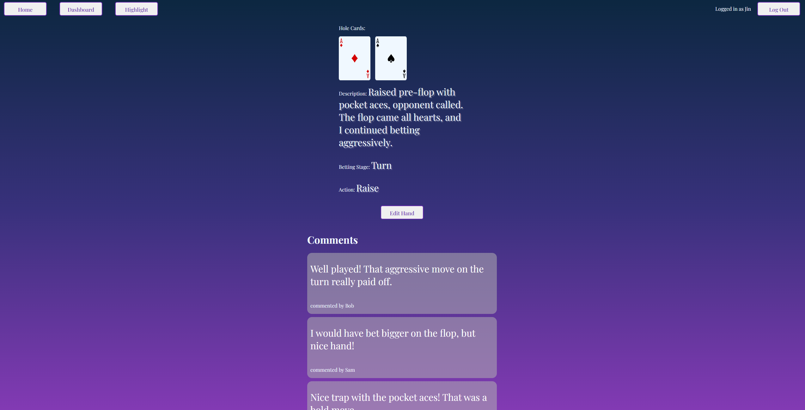
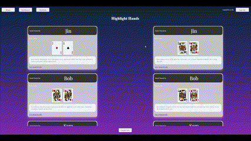
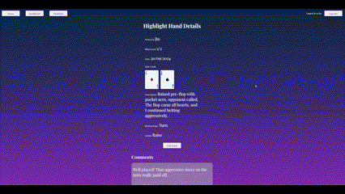

# StackTrack: Poker Bankroll Management App - project2
Thank you for checking out **StackTrack**, your go-to app for managing your poker bankroll! Whether you're grinding micro stakes or playing the high roller tables, this app helps you track your wins and losses efficiently, so you can stay focused on your strategy! :chart_with_upwards_trend:
## [Click here](https://project2-stacktrack.onrender.com) :computer_mouse: to see my live project! 
## About :open_book:
- StackTrack allows poker players to easily record their play sessions across different blind levels, track their bankroll performance, and even share highlight plays with the community. :trophy:
- Players can review their session history, submit highlight plays, and provide feedback on others' hands to improve decision-making at every stage of the game.
- To download **StackTrack** from GitHub:
```
git clone https://github.com/cdc998/project2-StackTrack.git
cd project2-StackTrack
```
- Create a PSQL database based on the schema file.
```
npm i
npm start
```
- Navigate to your preferred web browser, and access the web app through port **4444**. :computer:

In-game screenshots :framed_picture:




## Key Features :star2:
- Play History: Track your wins, losses, and notes for each poker session based on different blind levels.
- Highlight Plays: Save and share your most interesting hands, and receive feedback from other players to improve your game. :handshake:
- Comment System: Engage with other users by leaving comments on their highlight plays, offering advice and feedback. :memo:

## Planning & Problem Solving :bookmark_tabs:
- I initially focused on creating the backend CRUD functionality for users to add, update, and delete their session data.
- I utilised ER diagrams to clearly define how many views I would need, the CRUD operation needed to be executed between pages to provide functionality to users. This step allowed a strong directionality from the beginning of the project. :gear:
- I ensured data validation was in place to prevent incomplete or incorrect submissions. 
- Once the core functionalities were complete, I incorporated community features like submitting highlight plays and allowing comments for feedback.
- Throughout the development process, I refactored the code for clarity and simplicity, following best practices like DRY principles. :bulb:

## In-Progress Screenshots :framed_picture:


## Technologies Used :computer:
- Backend: Node.js, Express.js
- Database: PostgreSQL
- Frontend: HTML5, CSS, JavaScript
- User Authentication: Bcrypt for password hashing
- Templating Engine: EJS
- Version Control: Git and GitHub

## Favourite Tech from the Project :battery:




## Bugs to Fix :bug:
- Currently, there are no major bugs, but some minor UI fixes are required to improve responsiveness on mobile devices. :wrench:

## Lessons Learned :memo:
- Planning the data structure and relationships early on saved a lot of debugging time down the line.
- Implementing Bcrypt for password security gave me insights into how to safely handle user data. :lock:
- Making the decision to modularize the code for the CRUD operations made future updates much easier and cleaner. :pencil2:

## Future Features :rocket:
- Advanced Statistics: Allow users to view charts and graphs of their performance trends over time.
- Customizable Filters: Users can filter their history based on specific blind levels or date ranges.
- Enhanced Highlight Plays: Allow users to upload screenshots or replays to go along with their hand descriptions.
- Interactive Feedback: Add voting or ranking features to the comments section for more structured feedback on plays. :trophy: